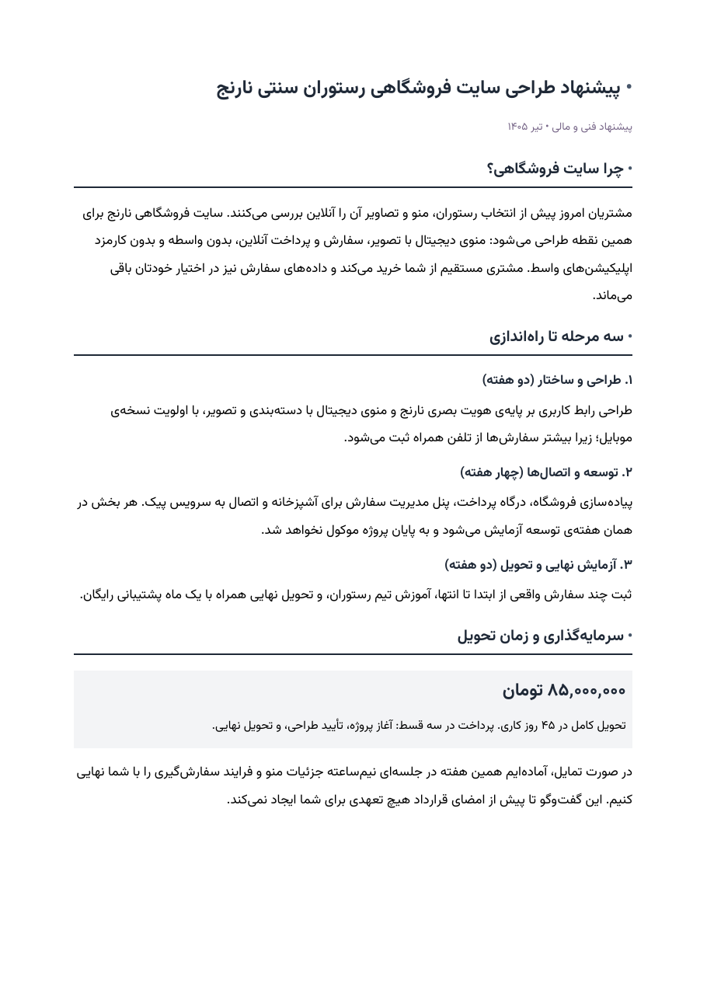

# persian-writing

**نگارش فارسی حرفه‌ای برای هوش مصنوعی — Professional Persian (Farsi) writing & RTL documents for any AI**

[](LICENSE)
[](https://claude.ai)
[](AGENTS.md)
[](references/fonts.md)

AI output in Persian has two chronic failures: prose that screams «متن هوش
مصنوعی» (می‌باشد، لازم به ذکر است، rule-of-three triads, em dashes) and
documents that betray the text (left-aligned "RTL", broken نیم‌فاصله, Arabic
ي/ك, orphan headings, DejaVu fallback glyphs). This skill fixes both, in one
package, for any AI that can read Markdown.



## What it does

| Layer | Coverage |
|---|---|
| **Register detection** | ۶-step procedure: رسمی / اداری / محاوره / علمی — classifies the deliverable, not the request tone; asks when stakes are high |
| **De-AI-ing (humanizer-fa)** | 18 Persian AI-tell patterns with before/after fixes |
| **Orthography** | نیم‌فاصله (ZWNJ)، ی/ک فارسی، اعداد فارسی، «گیومه»، کسره‌ی اضافه |
| **Cleanup toolkit** | paknevis + davat merged: `--edit`, `--preset persian`, spell-check against a 453K-word frequency dictionary — zero dependencies |
| **RTL documents** | Word/docx (START-not-RIGHT, `bidi`, `cs` fonts), pagination (keepNext, cantSplit, no blank pages), PDF verification, PowerPoint, HTML/CSS/email, Excel (`rightToLeft`), images (PIL raqm) |
| **Academic** | نگارش علمی: structure, citations without fabrication, formulas/stats LTR |
| **SEO + copywriting** | Search intent, Persian keyword variants, E-E-A-T, doorway-page warning, PAS/AIDA, CTA per register, «قیمت همیشه با تومان» |
| **Fonts** | Vazirmatn (5 weights) + Lalezar bundled (SIL OFL); catalog & pairings for 8 families |

## Install

**Claude.ai / Cowork:** download `persian-writing.skill` from
[Releases](../../releases) → open in Claude → **Save skill**.

**Claude Code:**
```bash
git clone https://github.com/ali2000hos/persian-writing ~/.claude/skills/persian-writing
```
or as a plugin: `/plugin marketplace add ali2000hos/persian-writing`

**Cursor / Windsurf / other agents:** clone into your repo (e.g.
`skills/persian-writing/`) and add one rule line:
`For any Persian/Farsi task, read skills/persian-writing/SKILL.md and follow it.`
See [AGENTS.md](AGENTS.md).

**ChatGPT / Gemini / chat-only AIs:** upload
[`universal/persian-writing-universal.md`](universal/persian-writing-universal.md)
as knowledge (GPTs / Projects / Gems) — the whole skill in one self-contained file.

**No AI at all (plain CLI):**
```bash
python3 scripts/persian_cleanup.py --edit --spellcheck draft.txt   # fix + spell-check
python3 scripts/fa_lint.py --check draft.txt                       # lint report
python3 scripts/verify_pdf.py out.pdf --expect-font Vazirmatn      # PDF QA
```
Python 3.8+, standard library only.

## Before / after (one of 18 patterns)

> ❌ در دنیای امروز، داشتن وب‌سایت از اهمیت ویژه‌ای برخوردار می‌باشد و نقش
> بسزایی در جذب مشتریان ایفا می‌کند.
>
> ✅ مشتری قبل از این‌که به شما زنگ بزند، اسمتان را گوگل می‌کند. اگر چیزی
> پیدا نکند، سراغ رقیبتان می‌رود.

## Package layout

```
SKILL.md                 entry point: routing + non-negotiables
AGENTS.md                guidance for any AI agent
references/              writing-style, orthography, academic, seo-copywriting,
                         fonts, docx-pdf, pptx, html-css, format-skills-fa, cleanup/
scripts/                 persian_cleanup, fa_lint, verify_pdf,
                         install_fonts, download_fonts, build_universal
assets/                  fonts (TTF) + 453K-word dictionary
universal/               single-file edition for chat-only AIs
.claude-plugin/          Claude Code plugin manifests
evals/                   regression test prompts
```

After editing SKILL.md or references, regenerate the single-file edition:
`python3 scripts/build_universal.py`

## Version history

- **1.0.0** — initial release: 4 registers + detection procedure, 18 AI-tell
  patterns, paknevis+davat cleanup with frequency-ranked spell-check, RTL
  recipes for docx/pptx/html/xlsx/images, PDF verification, academic + SEO +
  copywriting modules, Vazirmatn/Lalezar bundled. Benchmarked at 100% vs 79%
  (with/without skill) on register, orthography and RTL-structure assertions.

## Credits & license

MIT — see [LICENSE](LICENSE). Fonts under SIL OFL: [Vazirmatn](https://github.com/rastikerdar/vazirmatn)
and the rastikerdar family, [Lalezar](https://github.com/BornaIz/Lalezar) by
Borna Izadpanah. Cleanup toolkit merges [paknevis](https://github.com/afshin-ir/paknevis)
(afshin-ir) and [davat](https://github.com/mh-salari/davat) (mh-salari);
dictionary from [Persian-Words-Database](https://github.com/shahind/Persian-Words-Database).
AI-tell patterns adapted for Persian from Wikipedia's
["Signs of AI writing"](https://en.wikipedia.org/wiki/Wikipedia:Signs_of_AI_writing)
via the [humanizer](https://github.com/blader/humanizer) skill. E-E-A-T and
quality-gate principles adapted from [claude-seo](https://github.com/AgriciDaniel/claude-seo).
